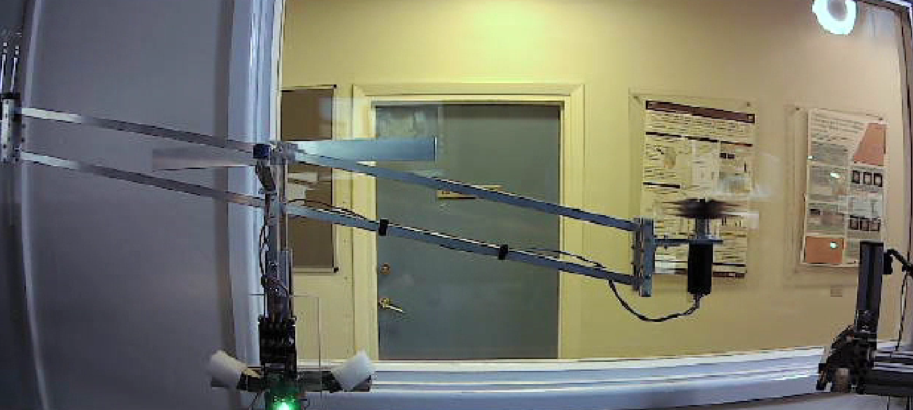

# MECH1010 Drone Controller Project

This project was developed as part of the **MECH1010 Mechatronics & Programming** module during my first year at the University of Leeds. The goal was to design and program a simple control system for a simulated helicopter (or drone arm) using an Arduino Uno.

## Project Summary

The system uses sensor feedback (e.g., potentiometer and angle sensor) to adjust motor speed via a proportional controller. It applies proportional control to height error, records whether the target tolerance is sustained, and initiates shutdown after a fixed five-second run.

### Objectives:
- Read angle data from sensors
- Implement a control algorithm to reach a target position
- Display system status via LEDs
- Log and output telemetry data

## Files

- `drone_controller.ino` — The full Arduino control code
- `flight_data.csv` — Logged sensor data from a test run
- `flight_demo.mp4` — Footage of the test in action

## Results

The repository includes a recorded test run, telemetry and a screenshot. These are examples from the coursework setup; no automated test suite or quantified performance analysis is included.

## Tech Stack

- Arduino Uno
- Potentiometer & angle sensor
- CSV logging

## Author

**William Cook [@willcook415]**  
Mechanical Engineering Student  
University of Leeds

---

> First-year coursework record. Hardware and calibration assumptions are specific to the original rig.
